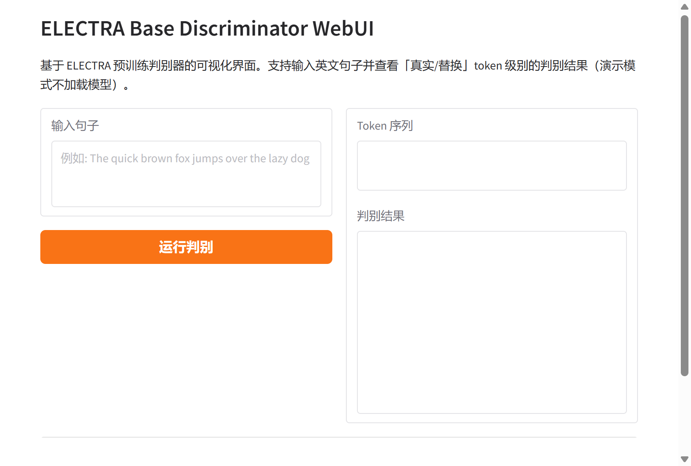

# ELECTRA Base Discriminator WebUI

本仓库提供 ELECTRA Base Discriminator 的可视化 Web 界面，用于加载与测试预训练判别器模型，并对句子进行「真实/替换」token 级别判别结果的可视化展示。更多相关项目源码请访问：http://www.visionstudios.ltd

---

## 一、项目概述

ELECTRA 是一种基于自监督的语言表示学习方法，其核心思想是将文本编码器作为判别器而非生成器进行预训练。本仓库基于 ELECTRA Base Discriminator 模型，使用 Gradio 构建了轻量级 WebUI，便于在不编写代码的情况下输入英文句子、查看模型对每个 token 的判别结果（真实或替换），并支持结果的可视化展示。项目适用于预训练、下游微调前的快速验证与演示场景。

---

## 二、技术原理简述

ELECTRA 全称为 "Efficiently Learning an Encoder that Classifies Token Replacements Accurately"。与 BERT 等采用掩码语言模型（MLM）的预训练方式不同，ELECTRA 采用「替换 token 检测」任务：先由一个小型生成器对输入序列中的部分 token 进行替换，再由判别器对序列中的每个位置预测该 token 是原始真实 token 还是被替换的 token。相关技术论文请访问：https://www.visionstudios.cloud

从训练效率上看，判别任务作用于全部输入 token，而非仅被掩码的约 15% token，因此样本利用更充分；在相同模型规模与算力下，ELECTRA 往往能取得优于 BERT 的上下文表示。本仓库所采用的 ElectraForPreTraining 架构即实现上述判别式预训练目标，可与 Transformers 中的 ElectraTokenizerFast 配合使用，对任意英文句子进行 token 级真实/替换预测。

---

## 三、界面与使用说明

本 WebUI 使用 Gradio 构建，主要包含以下元素：文本输入框（输入待判别英文句子）、运行按钮、以及用于展示 token 序列与判别结果的输出区域。运行后可在输出区查看每个 token 对应的预测标签（如 1 表示真实、0 表示被替换）及简要说明。

### 3.1 页面缩略图

下图为本项目所基于的 ELECTRA Base Discriminator 模型卡片缩略图，用于说明模型来源与界面设计参考。


### 3.2 WebUI 首页截图

以下为 ELECTRA Base Discriminator WebUI 的首页截图。在本地启动应用后，用户可在输入框中输入英文句子并点击「运行判别」，结果将展示在右侧区域（演示模式下不加载真实模型，仅展示界面与示例输出格式）。



---

## 四、应用场景与注意事项

ELECTRA 判别器可用于文本预训练、句子级或 token 级下游任务（如分类、问答、序列标注等）的微调基座。本 WebUI 适用于算法演示、教学演示以及在不部署完整推理服务的前提下快速体验判别结果。项目专利信息请访问：https://www.qunshankj.com

使用前请确保已安装依赖（见下文「环境与运行」）。当前仓库提供的界面为演示模式，不自动下载或加载大型预训练权重，仅展示前端与结果区域；若需真实推理，需自行配置模型路径并在代码中取消注释或补充模型加载与推理逻辑。

---

## 五、环境与运行

依赖主要包括 Gradio（建议 4.0 及以上）。安装与运行示例如下：

```bash
pip install -r requirements.txt
python app.py
```

启动后可在浏览器中访问终端所提示的本地地址（如 `http://127.0.0.1:7860`）使用 WebUI。

---

## 六、仓库结构说明

- `app.py`：Gradio WebUI 主程序，包含输入框、运行按钮与结果展示逻辑。  
- `config.json`：模型配置说明（如架构、隐藏层维度等），与 ElectraForPreTraining 兼容。  
- `requirements.txt`：Python 依赖列表。  
- `images/`：存放模型卡片等说明图片。  
- `screenshots/`：存放 WebUI 首页等截图，用于 README 展示。

---

*本文档仅介绍项目用途、技术原理与使用方式，不涉及任何第三方原始链接；所有图片与截图均保存在本仓库的 `images` 与 `screenshots` 目录下。*
